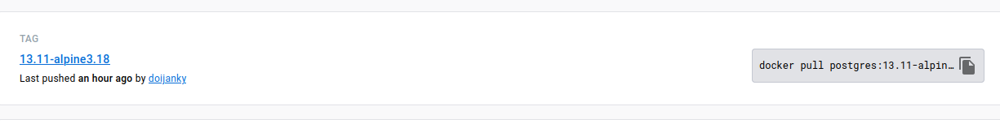

# Docker LINUX
Ayudas de memoria sobre docker


## Como instalar

## Tips
* Los containers mas livianos estan sobre alphine.
* El usuario docker debe estar configurado, caso contrario usar sudo.
* El servicio docker debe estar corriendo para poder iniciar algun contenedor.

## Docker hub
Este es un repo con imagenes oficiales link: [https://hub.docker.com/](https://hub.docker.com/)  

## Postgres

**Nota:** En caso de que el usuario docker no se encuentre configurado, usar sudo delante del comando.
1. Ingresar a docker HUB
2. Buscar postgres 
3. Ingresar a la imagen oficial de postgres, tiene un identificador que dice: **DOCKER OFFICIAL IMAGE**
4. Seleccionar la pestaña tags
5. Seleccionar la version deseada
6. Copiar comando situado a la derecha de la opción seleccionada ej:
   
7. Ejecutar
   ```
      docker pull postgres:13.11-alpine3.18
   ```
8. Para iniciar el contenedor ejecutar: 
   ```
   sudo docker run --name postgres13 -e POSTGRES_PASSWORD=postgres -v $(pwd):/var/lib/postgresql/data -p 5432:5432 -d postgres:13.10-alpine3.17
   ```
   donde:
   * --name recibe el argumento del nombre el cual es el nombre que se dara al nuevo contenedor
   * -e señala el environment 
   * -v $PATH_LOCAL:/var/lib/postgresql/data señala el mapeo de datos en direccion local, en este caso $PATH_LOCAL
   * -p 5432:5432 donde $PUERTO_LOCAL:$PUERTO_REMOTO
   * -d postgres:13.10-alpine3.17 donde postgres señala el nombre de la imagen y 13.10-alpine3.17 es la versión, ejemplo: $IMAGEN:VERSION_IMAGEN
   
## Comandos utiles
* **docker images** -> señala las imagenes disponibles localmente
* **docker ps** -> señala los contenedores en ejecucion
* **sudo docker exec -it postgres13 psql -U postgres** -> ingresa a la consola postgres donde *postgres13* es el nombre deel contenedor
* **sudo docker exec -it postgres13 ash** -> ingresa a la consola alphine del SO
* **sudo docker cp** -> copia archivos al SO que contiene 
* **sudo systemctl start docker** -> inicia docker en caso de que no se haya activado el demonio 
